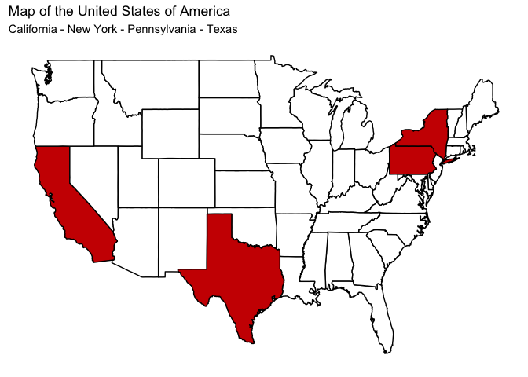
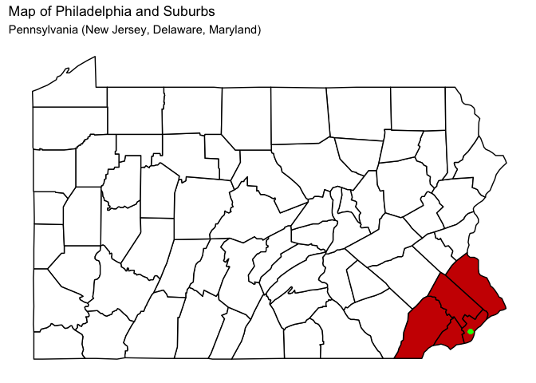
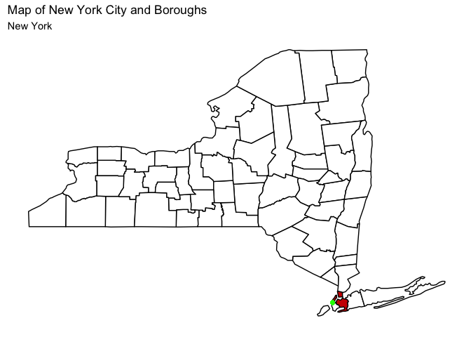
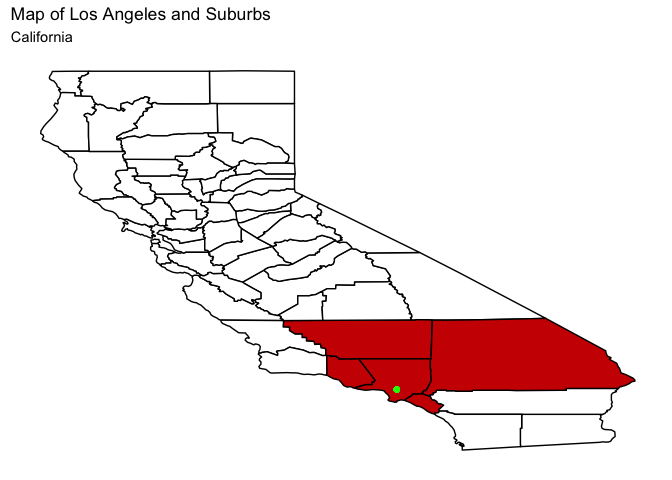
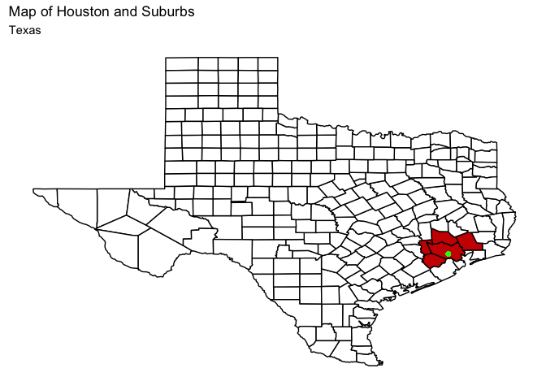

Introduction Maps
================

# Setup Data

``` r
library(tidyverse)
```

    ## ── Attaching packages ─────────────────────────────────────── tidyverse 1.3.0 ──

    ## ✓ ggplot2 3.3.2     ✓ purrr   0.3.4
    ## ✓ tibble  3.0.4     ✓ dplyr   1.0.2
    ## ✓ tidyr   1.1.2     ✓ stringr 1.4.0
    ## ✓ readr   1.4.0     ✓ forcats 0.5.0

    ## ── Conflicts ────────────────────────────────────────── tidyverse_conflicts() ──
    ## x dplyr::filter() masks stats::filter()
    ## x dplyr::lag()    masks stats::lag()

``` r
library(ggplot2)
library(maps)
```

    ## 
    ## Attaching package: 'maps'

    ## The following object is masked from 'package:purrr':
    ## 
    ##     map

``` r
library(readxl)
library(janitor)
```

    ## 
    ## Attaching package: 'janitor'

    ## The following objects are masked from 'package:stats':
    ## 
    ##     chisq.test, fisher.test

``` r
us_states <- map_data("state")

states <- read_excel("/Users/TyPainter1/Desktop/Masters/Fall\ 2020/DS-5610/eda20-team5-project/2.\ Graph\ Creation/Maps/states.xlsx")
# usa <- ggplot(data = us_states,
#             mapping = aes(x = long, y = lat,
#                           group = group))+
#   geom_polygon(fill = "white", color = "black")
# usa
states$name <- tolower(states$Name)
us_states <- left_join(us_states, states, by = c("region" = "name"))
#new_df <- left_join(us_states, df, by = c("postal_code"="stateusps"))
```

# USA

``` r
usa_map <- us_states %>% mutate(state_used = ifelse(us_states$`Postal Code` %in% c("PA", "CA", "TX", "NY"), "Yes", "No")) %>% 
  ggplot(mapping = aes(x = long, 
                       y = lat, 
                       group = group, 
                       fill = state_used)
         ) +
  geom_polygon(color = "black") +
  scale_fill_manual(values = c("white","red3")) +
  theme(legend.position = "none",
        panel.grid = element_blank(),
        axis.title = element_blank(),
        axis.text = element_blank(),
        axis.ticks = element_blank(),
        panel.background = element_blank()) +
  labs(title = "Map of the United States of America",
       subtitle = "California - New York - Pennsylvania - Texas")

usa_map
```

<!-- -->

# Philadelphia and Suburbs

``` r
us_counties <- map_data("county")

philly_map <- us_counties %>% filter(region == "pennsylvania") %>%
  mutate(county_used = ifelse(subregion %in% c("bucks", "chester", "delaware", "montgomery", "philadelphia"), "y","n")) %>% 
  ggplot(mapping = aes(x = long, 
                       y = lat, 
                       group = group, fill = county_used)
         ) +
  geom_polygon(color = "black") +
  scale_fill_manual(values = c("white","red3")) +
  theme(legend.position = "none",
        panel.grid = element_blank(),
        axis.title = element_blank(),
        axis.text = element_blank(),
        axis.ticks = element_blank(),
        panel.background = element_blank()) +
  labs(title = "Map of Philadelphia and Suburbs",
       subtitle = "Pennsylvania (New Jersey, Delaware, Maryland)") +
  geom_point(y = 39.9526, x = -75.1652, color = "green", size = 1.5) 

philly_map
```

<!-- -->

# New York City and Boroughs

``` r
nyc_map <- us_counties %>% filter(region == "new york") %>%
  mutate(county_used = ifelse(subregion %in% c("bronx", "manhattan", "new york", "queens", "staten island", "brooklyn"), "y", "n")) %>% 
  ggplot(mapping = aes(x = long, 
                       y = lat, 
                       group = group, fill = county_used)
         ) +
  geom_polygon(color = "black") +
  scale_fill_manual(values = c("white","red3")) +
  theme(legend.position = "none",
        panel.grid = element_blank(),
        axis.title = element_blank(),
        axis.text = element_blank(),
        axis.ticks = element_blank(),
        panel.background = element_blank()) +
  labs(title = "Map of New York City and Boroughs",
       subtitle = "New York") +
  geom_point(y = 40.7128, x = -74.0060, color = "green") 

nyc_map
```

<!-- -->

# Map of Los Angeles and Suburbs

``` r
la_map <- us_counties %>% filter(region == "california") %>%
  mutate(county_used = ifelse(subregion %in% c("ventura", "orange", "kern", "san bernardino", "los angeles"), "y", "n")) %>% 
  ggplot(mapping = aes(x = long, 
                       y = lat, 
                       group = group, fill = county_used)
         ) +
  geom_polygon(color = "black") +
  scale_fill_manual(values = c("white","red3")) +
  theme(legend.position = "none",
        panel.grid = element_blank(),
        axis.title = element_blank(),
        axis.text = element_blank(),
        axis.ticks = element_blank(),
        panel.background = element_blank()) +
  labs(title = "Map of Los Angeles and Suburbs",
       subtitle = "California") +
  geom_point(y = 34.0522, x = -118.2437, color = "green") 

la_map
```

<!-- -->

# Map of Houston and Suburbs

``` r
houston_map <- us_counties %>% filter(region == "texas") %>%
  mutate(county_used = ifelse(subregion %in% c("harris", "fort bend", "montgomery", "waller", "liberty"), "y", "n")) %>% 
  ggplot(mapping = aes(x = long, 
                       y = lat, 
                       group = group, fill = county_used)
         ) +
  geom_polygon(color = "black") +
  scale_fill_manual(values = c("white","red3")) +
  theme(legend.position = "none",
        panel.grid = element_blank(),
        axis.title = element_blank(),
        axis.text = element_blank(),
        axis.ticks = element_blank(),
        panel.background = element_blank()) +
  labs(title = "Map of Houston and Suburbs",
       subtitle = "Texas") +
  geom_point(y = 29.7604, x = -95.3698, color = "green") 

houston_map
```

<!-- -->
